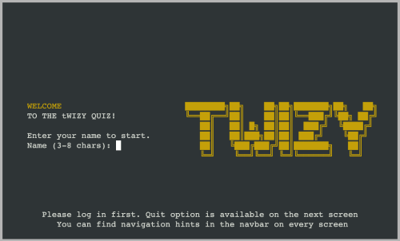
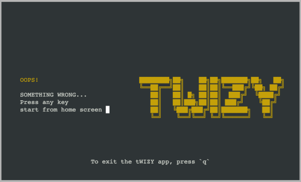

# tWIZY CLI application

<i>In a world of graphical displays, one might ask “why bother”?  
It’s true that character-cell display terminals are an obsolete technology,  
but there are niches in which being able to do fancy things with them are still valuable.</i> 
<a href="https://docs.python.org/3/howto/curses.html">A.M. Kuchling, Eric S. Raymond</a>

## Table of Contents

- [Project Description](#project-description)
  - [Purpose](#purpose)
  - [User Demographics](#user-demographics)
- [UX Design](#ux-design)
  - [User Stories](#user-stories)
- [Features](#features)
  - [Existing Features](#existing-features)
  - [Future Features](#future-features)
- [Technical Overview](#technical-overview)
  - [Architecture](#project-architecture)
  - [Flowchart](#flowchart)
  - [Data Model](#data-model)
- [Technologies](#technologies)
- [Deployment](#deployment)
  - [Github](#github)
  - [Heroku](#heroku)
- [Testing](#testing)
  - [User Stories Testing](#user-stories-testing)
  - [Manual Testing](#manual-testing)
  - [Unit Testing](#unit-testing)
  - [Automated Testing](#automated-testing)
- [Credits](#credits)
  - [Media](#media)
  - [Code](#code)
- [Acknowledgments](#acknowledgments)

# Project Description

tWIZY is a CLI-based quiz game that challenges players with various common questions. Players can earn points by answering questions correctly to achieve high scores, and to become a champion on the leaderboard.

The tWIZY application uses the Python curses library, perfect for creating a command-line interface (CLI) quiz game. Curses help manage the screen and handle user input, making it easy to create a dynamic and interactive experience. It allows for a clean and organized display, refreshing the screen with each new user action, such as selecting answers or navigating menus.

The game uses Google Sheets as a database to store the quiz questions and the records of top players. This setup allows for easy updates and management of data.

tWIZY game is deployed on Heroku, making it accessible and convenient for players to enjoy from anywhere.

The tWIZY CLI app is built using Python and a little HTML, CSS as a Portfolio Project#3 for the Code Institute's Full Stack Developer(e-Commerce) course.

[The live tWIZY CLI application](https://twizy-60a6fbc7304c.herokuapp.com/)

## Purpose

tWIZY is a quiz game that’s easy to play and manage. It’s perfect for anyone who wants to test their knowledge, learn new things, and enjoy some friendly competition.

The app was created as part of a project portfolio to demonstrate the development and deployment of a CLI-based quiz game. It showcases skills in coding, database integration, and deployment on platforms like Heroku.

## User Demographics

tWIZY game could be interesting for a variety of users:

- from trivia lovers, who enjoys a good game,
- to tech enthusiasts, who are interested in learning about projects with Google Sheets and Heroku.

[Back to top](#table-of-contents)

# UX Design

## User Stories

As a **user**,

- I want to navigate through the app using buttons, so I can easily access different features.
- I want a skeleton screen to appear when a page loads if needed. This will let me know the content is coming and the app isn't stuck.
- I want to view instructions, so that I understand how to play the game.
- I want to see something personal, like my name.
- I want to be able to start a new quiz game easily.
- I want to abort the game at any time by pressing the button.
- I want to see my quiz score and tier after completing a game.
- I want to view the top scores on the Champions board.
- I want to make sure I don't get lost on this website.

[Back to top](#table-of-contents)

# Features

## Existing Features

### F01 Navigation bar

_Home_, *Champions*, *Game*, and *Outcome* screens have a sticky navigation bar at the top. \
This bar shows the **tWIZY** app name and links to other available screens. For example, on the Home screen, you can press `c` to go to the Champions screen, `g` to start a new game, and `q` to quit the app.

### F02 Login screen

On the tWIZY CLI application, the first thing the user sees is a bold and vibrant tWIZY app name in yellow. It's simple yet elegant.
A welcoming message greets the user, with a field to enter their name. This field only accepts names between 3 to 8 characters long. Users can easily edit their names by deleting and retyping letters before pressing Enter to continue, to Home screen.

The tWIZY application uses the Python curses library, which refreshes the screen whenever a key is pressed. To allow users to delete letters with the backspace key, a special code block was added to handle this functionality.

The username must be between 3 and 8 letters long. Only alphabetic characters are allowed — no numbers, spaces, or special symbols.
This ensures the username is simple and unique, making it easy to recognize during gameplay.  
If the input doesn't meet these criteria, an error message `Error: username too short` will appear for shorter than 3 letters name or a hint message `Hint: Only letters please` for not allowed characters.

### F03 Home screen

On the home screen of the tWIZY app, the user can find the rules for the tWIZY quiz game. They also see the username they entered on the previous login screen (it also applicable for Game and Outcome screens). This screen features a frame that surrounds the rules and a navigation hint.

From the Home screen, the player has three navigation options:

- Press `c` to view the current Champions board.
- Press `g` to start playing a game.
- If the user is ready to leave, press `q` to exit the tWIZY game.

### F04 Game screen

Finally, the user reaches the game itself.
The Game screen presents a quiz where players answer a series of 10 questions.
Each question appears one at a time with multiple-choice options, and users select their answer by pressing Enter.
The selected answer option is highlighted with inversive colors (the background and letter colors are swapped), making it easy to see which choice user has made.
After answering the 10th question, the game transitions to the Outcome screen, where results are displayed, giving a summary of how well player performed.

Navigating through the answer options is intuitive,
using the up and down buttons, and the Enter button to select. Throughout the game, a helpful
navigation hint is displayed at the bottom of the screen.

From the Game screen, the player has two navigation options:

- Press `a` to exit the current game and return to the Home screen.
- If the user is ready to leave, press `q` to exit the tWIZY game.

### F05 Outcome screen

After completing the quiz in tWIZY, the player is taken to the Outcome screen.
This screen shows the final score and tier based on performance.
If the user achieves a high enough score, they will earn a place on the champions board. \
This screen provides a clear and satisfying summary of performance and encourages the player to
aim for higher scores and better tiers in future games.

On the Outcome screen, the user has four navigation options:

- Press `h` to return to the Home screen.
- Press `g` to start a new quiz and try to improve a score.
- Press `c` to view the current Champions board.
- Press `q` to quit the tWIZY application.

### F06 Champions screen

The Champions screen in tWIZY showcases the top 5 players and their scores.
It serves as both a leaderboard and a motivator for users to achieve higher scores.

On the Champions screen, the user has three navigation options:

- Press `h` to return to the Home screen.
- Press `g` to start a new quiz and try to improve a score.
- If the user is ready to leave, press `q` to exit the tWIZY application.

### F07 Error screen

If, for any reason (such as a Google spreadsheet connection error), the user encounters a special Error screen.

Upon reaching this error page, all records associated with this account will be deleted, except for the login, if it was already present.

- If the login is not defined or its length is 0, the user will be redirected to the Login screen to enter the login credentials.
- If a valid login is present, the user will be redirected to the Home screen.

Additionally, the user always has the option to exit the tWIZY application, by clicking `q`.

### F08 Skeleton screens

In tWIZY, skeleton screens help provide a smooth and intuitive experience while different parts
of the game are loading. These screens feature a navbar, a frame with the screen's name,
and a friendly message letting you know that content is on its way.

#### Game Skeleton Screen

The Game skeleton screen displays the navbar and a frame with the screen's name "tWIZY GAME" with the message,
_Your quiz is on its way, please wait..._. This indicates that the quiz questions and answer options will appear soon.

#### Outcome Skeleton Screen

The Outcome skeleton screen includes the navbar and a frame with the screen's name "GAME OUTCOME" and the message, _Your quiz outcome is on its way, please wait..._. This helps users understand that their game score and tier will be shown soon.

#### Champions Skeleton Screen

When loading the Champions screen, the user'll see skeleton screen with the navbar and a framed area with the screen's name "CHAMPIONS BOARD" along with a message saying, _The Champions board is on its way, please wait..._. This lets users know that the top 5 player scores will be displayed shortly.

These skeleton screens are designed to ensure that players always know what to expect and where to find information,
even while the content is being loaded.

## Future Features

- Implement Redis to manage race conditions, ensuring that the champions' board is accurately updated even when two
  players submit scores simultaneously. This prevents conflicts and ensures all high scores are recorded correctly.
- Include an option to pause the game so that players can take breaks without worrying about time-sensitive elements
  or score loss.
- Provide hints or clues to users when they are stuck on a quiz question, helping them progress without frustration.
- Introduce a database for storing user information, including usernames and passwords. This will improve security
  and enable features like user authentication and personalized game experiences.
- Add multi-language support, allowing players from different regions to enjoy the game in their preferred language,
  enhancing accessibility and user engagement.

[Back to top](#table-of-contents)

# Technical Overview

The tWIZY app is a command-line interface (CLI) game created with Python. It uses a modular architecture to manage different screens including Login, Home, Game, Champions and Outcome.  
The app utilizes curses for a terminal-based UI, providing a dynamic and interactive user experience. It employs imperative programming principles to ensure smooth navigation and clear decision-making processes.  
Data is managed through local storage and external components, such as spreadsheet storage for high scores and quiz data.  
The app use a Python logging module that tracks events and errors, helping with debugging and monitoring performance. This logging system will be especially useful if tWIZY is deployed to a cloud platform (for instance, _AWS Amazon CloudWatch_), where logs can be easily checked and analyzed.   The app also has robust exception handling to manage unexpected issues, ensuring stability and providing useful feedback in case of errors.
The app is thoroughly tested using pytest to ensure that each part functions correctly and efficiently.

## Architecture

The tWIZY project architecture has three abstraction layers, each serving a specific purpose to ensure the app is organized, maintainable, and easily expandable:

**MAIN LAYER** (1 level):
This layer functions as the central controller of the application. It sets up the app, manages the overall flow, and handles the transitions between different screens. The run.py file is responsible for initializing the environment, including colors and storage, and managing runtime exceptions. It determines which screen to display based on user actions or game state, forming the backbone of the application's logic.

**SCREENS LAYER** (2 level):
This layer contains the primary UI logic for the app, with each file representing a specific screen or state in the user journey. Each screen file is responsible for displaying its particular view, handling user input, and passing control to the appropriate next screen based on user actions or game outcomes. For instance, `login_screen.py` manages the login process, while `game_screen.py` oversees the main gameplay. This separation allows focused development and testing of individual screens without impacting others.

> [!NOTE]
> There are no horizontal dependencies at this levels. The screen py files depend only on components py files.

**COMPONENTS LAYER** (3 level):
This layer provides reusable components and utilities that support the screens and the main application logic. Components in this layer handle specific tasks, such as displaying centered text (`centered_text.py`), managing the champions leaderboard (`champions.py`), rendering menus (`menu.py`), and calculating scores (`score.py`). By abstracting these functionalities into separate components, the app encourages code reuse and simplifies the development of new features or screens. This modular approach also makes the app easier to maintain and extend, as common functionalities are centralized and can be updated independently of the screens that use them.

**LIBRARIES**

The Libraries layer is responsible for handling interactions with external resources, such as storage systems.
For instance, `spreadsheet_storage.py` is used to connect with Google's spreadsheets to store and retrieve data, such as the list
of champions and quiz content.  
On the other hand, `local_storage.py` manages the storage and retrieval of key-value pairs in the local storage, for instance,
usernames, scores, and tiers. This layer abstracts the intricacies of data management, making it easier to swap out or modify
these services without impacting the rest of the tWIZY application.

**CONFIG**

The Config files contain constants and settings used throughout the tWIZY app. These configurations include game settings, color schemes,
and other global variables that control the tWIZY app's behavior.
Centralizing configurations allows for easy modification and consistent access across different parts of the application.

## Flowcharts

Flowcharts for the tWIZY app show the user journey and app logic. They outline how users move from login to different screens
like home, game, and outcome. Key choices, like selecting options or answering quiz questions, are highlighted to show how the app reacts.

<table>
<tr>
<td></td>
<td></td>
</tr>
</table>

## Data Model

tWIZY app uses a combination of local storage and Google Sheets to manage and persist data effectively.

**Local storage** is employed to store user-specific data in a key-value format for username, score, tier, quiz_time etc.
These values are stored locally during gameplay and are used to manage the user's progress and state within the app.

**Google Sheets** is used as a backend service to maintain a centralized record of the game's champions and quiz questions.
The _champions_ sheet stores the top players' names, scores, and timestamps, while the _quiz_ sheet contains the questions,
options, and correct answers used during the game.

At runtime, the tWIZY app fetches quiz data from Google Sheets and updates the champions list with the player's score after
the game ends. 
This integration allows for easy data management and retrieval, ensuring that the app scales efficiently as more users play the game.

[Back to top](#table-of-contents)

# Technologies

## Languages

- Python
- HTML5
- CSS

## Frameworks, Libraries & Apps

| Name                                                         | Purpose                                                 |
| :----------------------------------------------------------- | :------------------------------------------------------ |
| Heroku                                                       | Launch and host the CLI app                             |
| Google Spreadsheets API                                      | Store data                                              |
| Python Pytest                                                | Unit-testing                                            |
| Favicon.cc                                                   | Create website favicon                                  |
| [Dreamstudio.ai](https://beta.dreamstudio.ai)                | Create the tWIZY background image                       |
| [Photopea](https://www.photopea.com/)                        | Work with images (resize, convert, etc)                 |
| [GoDaddy](https://www.godaddy.com/)                          | Generate WIZY logo                                      |
| [Vmake.ai](https://vmake.ai/image-outpainting)               | Expand the image                                        |
| [Imagecolorpicker](https://imagecolorpicker.com)             | Color picker                                            |
| [Coolors](https://coolors.co)                                | Color pallete                                           |
| [Ezgif](https://ezgif.com/)                                  | Video editor                                            |
| [Websitemockupgenerator](https://websitemockupgenerator.com) | Create the README Mockup image                          |
| [LucidChart](https://lucid.app)                              | Create flowcharts                                       |
| [Figma](https://www.figma.com)                               | Create architecture abstraction layers image            |
| Balsamiq                                                     | Build interface website wireframes                      |
| Git                                                          | Use for version control                                 |
| GitHub                                                       | Store the source code and deploy and host the live site |
| GitPod                                                       | Set up and run project code                             |
| [Pep8ci.herokuapp](https://pep8ci.herokuapp.com)             | Validate Python code                                    |
| W3C HTML Markup Validator                                    | Validate HTML code                                      |
| W3C Jigsaw CSS Validator                                     | Validate CSS code                                       |
| Code Institute's Python Template                             | Generate the workspace for tWIZY project                |

[Back to top](#table-of-contents)

# Deployment

Code Institute has made it easier for others to access the project by providing a [template](https://github.com/Code-Institute-Org/python-essentials-template) to display the terminal
view of this backend application in a modern web browser on Heroku.

## How to clone

1. Visit the [tWIZY repository](https://github.com/tayapro/twizy) on GitHub.
2. Click the **Code** button on the right side of the screen, select **HTTPs**, and copy the provided link.
3. Open a terminal and navigate to the directory where you want to clone the repository.
4. On the command line, type `git clone`, paste the copied URL, and press the **Enter** key to begin the process.

> [!NOTE]
> To get everything set up, install the packages listed in the requirements.txt file. Run the command in the terminal:
> `pip3 install -r requirements.txt`
> This project uses confidential credentials, like `CREDS.json` to work with Google's spreadsheets, make sure to add it manually.

## Heroku

Heroku is a cloud platform that enables easy building, deploying, and managing of applications,
and it was chosen for the tWIZY project.

> [!NOTE]
> To ensure that the requirements.txt file includes all necessary dependencies, run the command in the terminal:
> `pip3 freeze > requirements.txt`
> After updating the file, commit the changes to GitHub.

Deployment steps:

1. Fork or clone the [tWIZY repository](https://github.com/tayapro/twizy).
2. Access your Heroku account.
3. Set up a new application on Heroku.
4. Configure Settings:
   In the Settings tab:
   Add the required environmental variables in the Config Vars section:

   - `CREDS`: Google service account credentials. \
      How to get it, see Google's [service account credentials](https://cloud.google.com/iam/docs/service-account-creds) documentation.
   - `PORT`: Set this to `8000`.

   In the Buildpacks subsection, set the buildpacks in the following order: `Python` **first**, then `Node.js`.

5. Deploy the App:
   In the Deploy tab:

   - Under App connected to GitHub, configure GitHub integration.

   In the Manual deploy subsection, select the main branch and click "Deploy Branch" to deploy the app.

[Back to top](#table-of-contents)

# Testing

## User Stories Testing

This section shows the connection between [Features](#features) and [UX design](#ux-design) sections.

### As a user,

- I want to navigate through the app using buttons, so I can easily access different features.

  > Each screen includes a set of buttons for easy navigation. These navigation options help users move between different parts of the tWIZY app. \
  > For more details, see the **F01 Navigation bar** feature section.

- I want a skeleton screen to appear when a page loads if needed. This will let me know the content is coming and the app isn't stuck.

  > The Game, Outcome, and Champions screens have skeleton screens that appear when a page is loading. These provide feedback to the user that the content is on its way and that the application is responsive. \
  > For more details, see the **F08 Skeleton screens** feature section.

- I want to view instructions, so that I understand how to play the game.

  > Users can easily learn the game rules on the Home screen, where everything is clearly and simply explained. \
  > For more details, see the **F03 Home screen** feature section.

- I want to see something personal, like my name.

  > On the Home, Game, and Outcome screens, a player can see their name in the top right corner. The name displayed will be the same as the one entered in the Login screen. \
  > For more details, see the **F02 Login screen**, and the **F03 Home screen** feature sections.

- I want to be able to start a new quiz game easily.

  > The user is able to start a new game from Home, Champions and Outcome screens,
  > just pressing a `g` button. \
  > For more details, see the **F03 Home screen**, the **F04 Game screen** and the **F05 Outcome screen** feature sections.

- I want to abort the game at any time by pressing the button.

  > If the player does not feel okay to continue a current game, they always have the option to abort it by pressing the 'A' button. The tWIZY app will redirect to the Home screen.
  > For more details, see the **F04 Game screen**, feature sections.

- I want to see my quiz score and tier after completing a game.

  > The Outcome screen provides a summary of the user's results, including their tier, score,
  > and potential placement on the Champions board. \
  > For more details, see the **FF05 Outcome screen**, feature sections.

- I want to view the top scores on the Champions board.

  > The Champions screen shows a leaderboard featuring the top 5 scores achieved by players. \
  > For more details, see the **F06 Champions screen** feature section.

- I want to make sure I don't get lost on this website.

  > If the user finds themselves on the Error screen, they can easily find concise instructions on how to return to the tWIZY Home screen. \
  > For more details, see the **F07 Error screen** features section.

## Manual Testing

The tWIZY app underwent comprehensive feature testing to ensure smooth gameplay and accurate scoring.
All key functionalities, including quiz flow, score calculations, and screen transitions, were tested and passed
successfully without any critical issues, [link to Google sheet](https://docs.google.com/spreadsheets/d/191EvvpGPkVgskTXMwpqk6Uv7IbMwSZuCgMlu29p5Xcc/edit?gid=29067541#gid=29067541).

  

manual test results

    
    
    
    
  

## Unit Testing

<table>
<tr>
<td></td>
<td>To ensure the tWIZY CLI app works correctly, unit testing was performed using <code>pytest</code>.   
  <code>Pytest fixtures</code> were utilized to set up and reuse common test data across multiple tests, 
  which helps maintain organization and efficiency in tWIZY tests.  
  To run the tests:

<ul>
  <li>Install the project's dependencies <code>pip3 install -r requirements.txt</code></li>
  <li>and run in the terminal <code>pytest</code></li>
</ul>

<b>pytest screenshot</b>

   

 

To check unit tests coverage, run the following command in terminal from tWIZY root directory:  
<code>pytest --cov=. tests/</code>

<b>pytest coverage screenshot</b>

</td>
</tr>
</table>

## Validator testing

[Back to top](#table-of-contents)

# Credits

## Media

- Background image has been generated by [dreamstudio.ai](https://beta.dreamstudio.ai/)
- [Unit testing all green](https://www.threads.net/@testingil/post/C9Ki-rHtGHW) picture.

## Code

- The setup for work with Google speadsheets is adapted from the "Love Sandwiches" lesson.
- Knowledge of Python classes with [RealPython](https://realpython.com/python-classes/).
- Understanding of Python logging library with [RealPython](https://realpython.com/python-logging/).
- Knowledge of Python curses library with [short Youtube course](https://www.youtube.com/playlist?list=PLzMcBGfZo4-n2TONAOImWL4sgZsmyMBc8).
- Understanding of skeleton screen concept with [uxdesign.cc](https://uxdesign.cc/what-you-should-know-about-skeleton-screens-a820c45a571a).
- Understanding of Markdown formating for Githib, [Github-Markdown.md](https://gist.github.com/nikhilnayyar002/7a35e653d3d590e317c829243e73b110).
- Understanding of pytest with [Python testing with pytest by Brian Okken](https://tisten.ir/blog/wp-content/uploads/2019/01/Python-Testing-with-pytest-Pragmatic-Bookshelf-2017-Brian-Okken.pdf).

[Back to top](#table-of-contents)

# Acknowledgments

Huge thanks to my mentor, Ronan McClelland, for all his help and advice. \
He’s given me great tips and resources that really improved my coding and testing skills.

[Back to top](#table-of-contents)
