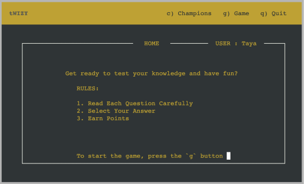
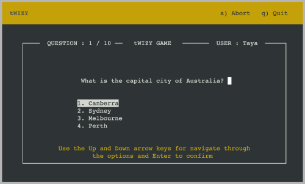

# tWIZY CLI application

> _In a world of graphical displays, one might ask “why bother”? \
> It’s true that character-cell display terminals are an obsolete technology, but there are niches in which being able to do fancy things with them are still valuable._ \
> [A.M. Kuchling, Eric S. Raymond](https://docs.python.org/3/howto/curses.html)

## Table of Contents

- [Project Description](#project-description)
  - [Purpose](#purpose)
  - [User Demographics](#user-demographics)
- [UX Design](#ux-design)
  - [User Stories](#user-stories)
  - [Structure](#structure)
- [Features](#features)
  - [Existing Features](#existing-features)
  - [Future Features](#future-features)
- [Technical Overview](#technical-overview)
  - [Architecture](#project-architecture)
  - [Flowchart](#flowchart)
  - [Data Model](#data-model)
- [Technologies](#technologies)
- [Deployment](#deployment)
  - [Github](#github)
  - [Heroku](#heroku)
- [Testing](#testing)
  - [User Stories Testing](#user-stories-testing)
  - [Manual Testing](#manual-testing)
  - [Unit Testing](#unit-testing)
  - [Automated Testing](#automated-testing)
- [Credits](#credits)
  - [Media](#media)
  - [Code](#code)
- [Acknowledgments](#acknowledgments)

# Project Description

tWIZY is a CLI-based quiz game that challenges players with a variety of common questions. Players can earn points by answering questions correctly to achieve high scores, with the goal of becoming a champion on the leaderboard.

The tWIZY application uses the Python curses library, which is perfect for creating a command-line interface (CLI) quiz game. Curses helps manage the screen and handle user input, making it easy to create a dynamic and interactive experience. It allows for a clean and organized display, refreshing the screen with each new user action, such as selecting answers or navigating menus.

The game uses Google Sheets as a database to store both the quiz questions and the records of top players. This setup allows for easy updates and management of data.

tWIZY game is deployed on Heroku, making it accessible and convenient for players to enjoy from anywhere.

The tWIZY CLI app is built using Python and a little HTML, CSS as a Portfolio Project#3 for the Code Institute's Full Stack Developer(e-Commerce) course.

[The live tWIZY CLI application](https://twizy-60a6fbc7304c.herokuapp.com/)

## Purpose

tWIZY is a quiz game that’s easy to play and manage. It’s perfect for anyone who wants to test their knowledge, learn new things, and enjoy some friendly competition.

The app was created as part of a project portfolio to demonstrate the development and deployment of a CLI-based quiz game. It showcases skills in coding, database integration, and deployment on platforms like Heroku.

## User Demographics

tWIZY game could be interesting for a variety of users:

- from trivia lovers, who enjoys a good game,
- to tech enthusiasts, who are interested in learning about projects with Google Sheets and Heroku.

[Back to top](#table-of-contents)

# UX Design

## User Stories

As a **user**,

- I want to navigate through the app using buttons, so I can easily access different features.
- I want to easily understand the primary objective of the tWIZY CLI app.
- I want to view instructions, so that I understand how to play the game.
- I want to see something personal, like my name.
- I want to be able to start a new quiz game easily.
- I want to navigate easily through the app using simple commands.
- I want to abort the game at any time by pressing the button.
- I want to see my quiz score and tier after completing a game.
- I want to view the top scores on the Champions board.
- I want to make sure I don't get lost on this website.

## Structure

[Back to top](#table-of-contents)

# Features

## Existing Features

### F01 Navigation bar

_Home_, *Champions*, *Game*, and *Outcome* screens have a sticky navigation bar at the top. \
This bar shows the **tWIZY** app name and links to other available screens. For example, on the Home screen, you can press `c` to go to the Champions screen, `g` to start a new game, and `q` to quit the app.

### F02 Login screen

On the tWIZY CLI application, the first thing the user sees is a bold and vibrant tWIZY app name in yellow. It's simple yet elegant.
A welcoming message greets the user, with a field to enter their name. This field only accepts names between 3 to 8 characters long. Users can easily edit their name by deleting and retyping letters before pressing Enter to continue.

The tWIZY application uses the Python curses library, which refreshes the screen whenever a key is pressed. To allow users to delete letters with the backspace key, a special code block was added to handle this functionality.

### F03 Home screen

On the home screen of the tWIZY app, the user can find the rules for the tWIZY quiz game. They also see the username they entered on the previous login screen. This screen features a frame that surrounds the rules and a navigation hint.

From the Home screen, the player has three navigation options:

1. Press `c` to view the current Champions board.
2. Press `g` to start playing a game.
3. And if the user is ready to leave, press `q` to exit the tWIZY game.

### F04 Game screen

Finally, the user reaches the game itself. Navigating through the answer options is intuitive,
using the up and down buttons, and the enter button to select. Throughout the game, a helpful
navigation hint is displayed at the bottom of the screen.

From the Game screen, the player has two navigation options:

1. Press `a` to exit the current game and return to the Home screen.
2. And if the user is ready to leave, press `q` to exit the tWIZY game.

### F05 Outcome screen

After completing the quiz in tWIZY, the player is taken to the Outcome screen.
This screen shows the final score and tier based on performance.
If the user achieves a high enough score, they will earn a place on the champions board. \
This screen provides a clear and satisfying summary of performance and encourages the player to
aim for higher scores and better tiers in future games.

On Outcome screen the user has four navigation options:

1. Press `h` to return to the Home screen.
2. Press `g` to start a new quiz and try to improve a score.
3. Press `c` to view the current Champions board.
4. Press `q` to quit the tWIZY application.

### F06 Champions screen

### F07 Error screen

### F08 Skeleton screen

## Future Features

[Back to top](#table-of-contents)

# Technical Overview

## Architecture

## Flowchart

## Data Model

[Back to top](#table-of-contents)

# Technologies

## Languages

- Python
- HTML5
- CSS

## Frameworks, Libraries & Apps

| Name                                                         | Purpose                                                 |
| :----------------------------------------------------------- | :------------------------------------------------------ |
| Heroku                                                       | Launch and host the CLI app                             |
| Google Spreadsheets API                                      | Store data                                              |
| Python Pytest                                                | Unit-testing                                            |
| Favicon.cc                                                   | Create website favicon                                  |
| [Dreamstudio.ai](https://beta.dreamstudio.ai)                | Create the tWIZY background image                       |
| [Photopea](https://www.photopea.com/)                        | Work with images (resize, convert, etc)                 |
| [GoDaddy](https://www.godaddy.com/)                          | Generate WIZY logo                                      |
| [Vmake.ai](https://vmake.ai/image-outpainting)               | Expand the image                                        |
| [Imagecolorpicker](https://imagecolorpicker.com)             | Color picker                                            |
| [Coolors](https://coolors.co)                                | Color pallete                                           |
| [Ezgif](https://ezgif.com/)                                  | Video editor                                            |
| [Websitemockupgenerator](https://websitemockupgenerator.com) | Create the README Mockup image                          |
| [LucidChart](https://lucid.app)                              | Create flowcharts                                       |
| Balsamiq                                                     | Build interface website wireframes                      |
| Git                                                          | Use for version control                                 |
| GitHub                                                       | Store the source code and deploy and host the live site |
| GitPod                                                       | Set up and run project code                             |
| [Pep8ci.herokuapp](https://pep8ci.herokuapp.com)             | Validate Python code                                    |
| W3C HTML Markup Validator                                    | Validate HTML code                                      |
| W3C Jigsaw CSS Validator                                     | Validate CSS code                                       |
| Code Institute's Python Template                             | Generate the workspace for tWIZY project                |

[Back to top](#table-of-contents)

# Deployment

## How to clone

1. Visit the [tWIZY repository](https://github.com/tayapro/twizy) on GitHub.
2. Click the **Code** button on the right side of the screen, select **HTTPs**, and copy the provided link.
3. Open a terminal and navigate to the directory where you want to clone the repository.
4. On the command line, type `git clone`, paste the copied URL, and press the **Enter** key to begin the process.

> [!NOTE]
> To get everything set up, install the packages listed in the requirements.txt file. Run the command in the terminal:
> `pip3 install -r requirements.txt`
> This project uses confidential credentials, like `CREDS.json` to work with Google's spreadsheets, make sure to add it manually.

## Heroku

Heroku is a cloud platform that enables easy building, deploying, and managing of applications,
and it was chosen for the tWIZY project.

> [!NOTE]
> To ensure that the requirements.txt file includes all necessary dependencies, run the command in the terminal:
> `pip3 freeze > requirements.txt`
> After updating the file, commit the changes to GitHub.

Deployment steps:

1. Fork or clone the [tWIZY repository](https://github.com/tayapro/twizy).
2. Access your Heroku account.
3. Set up a new application on Heroku.
4. Configure Settings:
   In the Settings tab:
   Add the required environmental variables in the Config Vars section:

   - `CREDS`: Google service account credentials. \
      How to get it, see Google's [service account credentials](https://cloud.google.com/iam/docs/service-account-creds) documentation.
   - `PORT`: Set this to `8000`.

   In the Buildpacks subsection, set the buildpacks in the following order: `Python` **first**, then `Node.js`.

5. Deploy the App:
   In the Deploy tab:

   - Under App connected to GitHub, configure GitHub integration.

   In the Manual deploy subsection, select the main branch and click "Deploy Branch" to deploy the app.

[Back to top](#table-of-contents)

# Testing

## User Stories Testing

## Manual Testing

## Unit Testing

## Validator testing

[Back to top](#table-of-contents)

# Credits

## Media

- Background image has been generated by [dreamstudio.ai](https://beta.dreamstudio.ai/)

## Code

- The setup for work with Google speadsheets is adapted from the "Love Sandwiches" lesson.

[Back to top](#table-of-contents)

# Acknowledgments

Huge thanks to my mentor, Ronan McClelland, for all his help and advice. \
He’s given me great tips and resources that really improved my coding and testing skills.

[Back to top](#table-of-contents)
